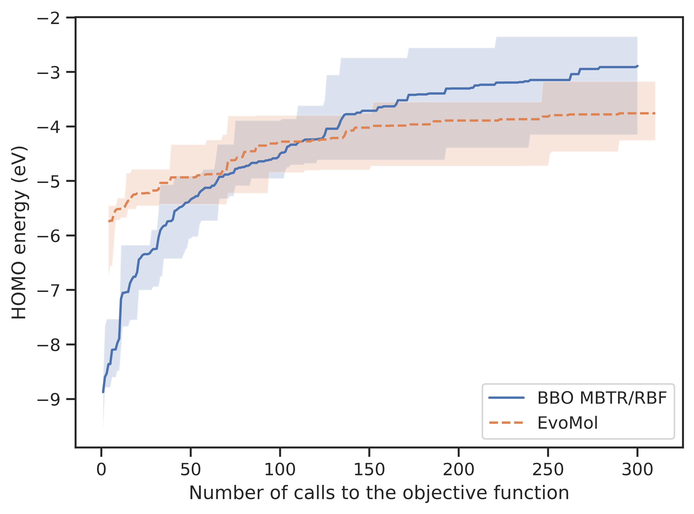

# BBOMol
Surrogate-based black-box optimization of molecular properties

## Installation

BBOMol depends on [EvoMol](https://doi.org/10.1186/s13321-020-00458-z) for evolutionary optimization of the surrogate 
function. Follow first the installation steps described on <a href='https://github.com/jules-leguy/evomol'>EvoMol 
repository</a>. Make sure to follow **Installation** and **DFT optimization** sections.

Then follow the following commands to install BBOMol.

```shell script
$ git clone https://github.com/jules-leguy/BBOMol.git     # Cloning repository
$ cd BBOMol                                               # Moving into BBOMol directory
$ conda activate evomolenv                                # Activating anaconda environment
$ python -m pip install .                                 # Installing BBOMol
```

Finally, type the following commands to install [ChemDesc](https://github.com/jules-leguy/ChemDesc), a dependency that 
is required to compute the molecular descriptors.

```shell script
$ cd ..                                                   # Go back to the previous directory if you are still in the BBOMol installation directory
$ git clone https://github.com/jules-leguy/ChemDesc.git   # Clone ChemDesc
$ cd ChemDesc                                             # Move into ChemDesc directory
$ conda activate evomolenv                                # Activate environment
$ conda install -c conda-forge dscribe                    # Installing DScribe dependency
$ conda install scikit-learn                              # Installing Scikit-Learn dependency
$ python -m pip install .                                 # Install ChemDesc
```

To use BBOMol, make sure to activate the *evomolenv* conda environment.

## Quickstart

Running a black-box optimization of the HOMO energy using an RBF-based kernel and the 
[MBTR](https://arxiv.org/abs/1704.06439) descriptor. The merit function that is optimized by the evolutionary algorithm
is the expected improvement of the surrogate function.

```python
from bbomol import run_optimization
from sklearn.gaussian_process import GaussianProcessRegressor
from sklearn.gaussian_process.kernels import RBF, WhiteKernel

run_optimization({
    "obj_function": "homo",
    "merit_optim_parameters": {
        "merit_type": "EI",
    },
    "surrogate_parameters": {
        "GPR_instance": GaussianProcessRegressor(1.0 * RBF(1.0) + WhiteKernel(1.0), normalize_y=True),
        "descriptor": {
            "type": "MBTR"
        }
    }
})
```

## Settings

A dictionary can be given to bbomol.run_optimization to describe the experiment to be performed. This dictionary can 
contain up to 6 entries, that are described in this section.

**Default values** are represented in bold.

### Objective function

The ```"obj_function"``` attribute describes the (costly) objective function to be optimized by the algorithm. It can
be defined according to the formalism of EvoMol. Any value accepted for this
attribute by EvoMol is also accepted here. This includes implemented functions (*e.g.* ```"homo"```), custom Python
functions evaluating a SMILES and functions combining several properties. See the relevant section in 
[EvoMol documentation](https://github.com/jules-leguy/EvoMol#objective-function).

### Surrogate parameters

The ```"surrogate_parameters"``` attribute describes the parameters of the Gaussian process regression model (Kriging) 
that is used as a surrogate of the objective function. This includes the setting of the molecular descriptor. It can
be set with a dictionary containing the following entries.
* ```"GPR_instance"``` : instance of sklearn.gaussian_process.GaussianProcessRegressor (**default :** 
```GaussianProcessRegressor(1.0*RBF(1.0)+WhiteKernel(1.0), normalize_y=True)```)
* ```"descriptor"```: a dictionary that defines the descriptor to be used to represent the solutions. The ```"type"``` 
attribute is used to select the descriptor, which can be configured using the following set of attributes.
  * ```"type"``` : name of the descriptor to be used.
    * **"MBTR"** : [many-body tensor representation](https://arxiv.org/abs/1704.06439), using 
  [DScribe](https://singroup.github.io/dscribe/latest/index.html) implementation.
    * "shingles" : boolean or integer vector of [shingles](https://doi.org/10.1186/s13321-018-0321-8).
    * "SOAP" : [smooth overlap of atomic positions](https://doi.org/10.1103/PhysRevB.87.184115), using 
[DScribe](https://singroup.github.io/dscribe/latest/index.html) implementation.

* *Parameter common to MBTR and SOAP*
  * ```"species"```: list of atomic symbols that can be represented (**["H", "C", "O", "N", "F"]**).
* *Parameters specific to MBTR (see 
[DScribe documentation](https://singroup.github.io/dscribe/latest/tutorials/descriptors/mbtr.html))*
  * ```"atomic_numbers_n"```, ```"inverse_distances_n"```, ```"cosine_angles_n"```: number of bins to 
respectively encode the atomic numbers (**10**), the interatomic distances (**25**) and interatomic angles (**25**).
* *Parameters specific to the vector of shingles*
  * ```"lvl"``` : radius of the shingles (**1**).
  * ```"vect_size"```: size of the descriptor (**2000**).
  * ```"count"``` : if False, the descriptor is a boolean vector that represents whether the i<sup>th</sup> shingle is 
present in the molecule. If True, the descriptor is an integer vector that counts the number of occurrences of the 
i<sup>th</sup> shingle in the molecule (**True**).
* *Parameters specific to SOAP (see 
[DScribe documentation](https://singroup.github.io/dscribe/latest/tutorials/descriptors/soap.html))*
  * ```"rcut"``` : cutoff for local environments (**6.0** Å)
  * ```"nmax"```, ```"lmax"``` : resp. the number of radial basis functions (**8**) and the maximum degree of spherical
harmonics (**6**).
  * ```"average"``` : whether to average all local environments (**"inner"**, "outer") or to consider the environments
independently ("off").

### Merit optimization parameters

The ```"merit_optim_parameters"``` attribute is used to describe the merit function and the parameters of its 
evolutionary optimization. It can be set with a dictionary containing the following entries.

* ```"merit_type"``` : merit function. It can be either the expected improvement of the surrogate function (**"EI"**), or 
the surrogate function directly ("surrogate").
* ```"merit_EI_xi"``` : value of the [ξ parameter](https://www.csd.uwo.ca/~dlizotte/publications/lizotte_phd_thesis.pdf)
of the expected improvement (**0.01**). This parameter is only interpreted if ```"merit_type"``` is set to "EI".
* ```"evomol_parameters"``` : dictionary describing the parameters for the evolutionary optimization of the merit 
function, using the [EvoMol](https://doi.org/10.1186/s13321-020-00458-z) algorithm. See the relevant section in 
[EvoMol documentation](https://github.com/jules-leguy/EvoMol#search-space). The ```"action_space_parameters"```
and ```"optimization_parameters"``` attributes can be set here. They respectively define the number of optimization 
steps at each merit optimization phase, and the chemical space of the solutions that will be generated. The other
attributes are set automatically by BBOMol. It is also possible to set the ```"io_parameters"``` attribute for specific
purposes, but some attributes may be overwritten. **Default value** :
  ```
  {
      "optimization_parameters": {
          "max_steps": 10,
      },
      "action_space_parameters": {
          "max_heavy_atoms": 9,
          "atoms": "C,N,O,F"
      }
  }
    ```
* ```"init_pop_size"``` : number of solutions that are drawn from the dataset of known solutions to be inserted in the
initial population of the evolutionary algorithm, at each optimization phase and for each evolutionary optimization 
instance (**10**).
* ```"init_pop_strategy"``` : strategy to select the solutions from the dataset of known solutions to be inserted in the
initial population of the evolutionary optimization instances. Available strategies :
  * "methane" : always starting the evolutionary optimization from the methane molecule.
  * "best" : selecting the ```"init_pop_size"``` best solutions according to the objective function.
  * "random" : selecting randomly ```"init_pop_size"``` solutions with uniform probability.
  * **"random_weighted"** selecting randomly ```"init_pop_size"``` solutions with a probability that is proportional to 
their objective function value.
* ```"n_merit_optim_restarts"``` : number of merit function evolutionary optimization instances at each merit 
optimization phase (**10**).
* ```"n_best_retrieved"``` : number of (best) solutions that are retrieved from each evolutionary optimization restart
to be evaluated using the objective function and inserted in the dataset of known solutions (**1**).

### Black-box optimization parameters

The ```"bbo_optim_parameters"``` attribute is used to define the parameters of the black-box
optimization. It can be set with a dictionary containing the following entries.
* ```"max_obj_calls"``` : number of calls to the objective function before stopping the algorithm (**1000**).
* ```"score_assigned_to_failed_solutions"``` : the default behaviour is to ignore the solutions that fail either
the descriptors computation or the evaluation by the objective function (**None**). An alternative is to set the given
score as objective function value for these solutions.

### Input/Output parameters

The ```"io_parameters"``` attribute is used to define the input/output parameters. It can be set with a dictionary
containing the following entries.
* ```"smiles_list_init"```: list of SMILES in the initial dataset of solutions (**["C"]**). It is also possible to give
the path to a text file that contains one SMILES per line.
* ```"results_path"``` : path of the directory that will be created by BBOMol and in which all results will be stored
for the experiment (**"BBOMol_optim/**).
* ```"save_surrogate_model"``` : whether to save the parameters of the latest surrogate model (**False**).
* ```"save_n_steps"```: period (number of steps) to write the progression of the optimization in ```"results_path"``` 
(**1**).
* ```"dft_working_dir"``` : path of the directory in which DFT calculations (if any) are performed and stored
(**"/tmp"**).
* ```"dft_cache_files"``` : list of paths of JSON files that store the results of previous DFT calculations (**[]**).
* ```"dft_base"```: DFT calculations base (__"3-21G*"__).
* ```"dft_n_jobs"```: number of threads assigned to each DFT calculation (**1**).
This cache will be used to avoid performing DFT calculations for solutions whose OPT results are already known. Keys
must be SMILES, that are associated with a dictionary that maps the property ("homo", "lumo", ...) with its value in eV.
* ```"MM_program"```: program and force field used to perform molecular mechanics optimization and initial geometry of 
DFT calculations. The options are :
    * **"rdkit_mmff94"** or "rdkit" to use the MMFF94 force field with [RDKit](https://doi.org/10.1186/s13321-014-0037-3)
    * "obabel_mmff94" or "obabel" to use the MMFF94 force field with [OpenBabel](https://doi.org/10.1186/1758-2946-3-33)
    * "rdkit_uff" to use the UFF force field with [RDKit](https://doi.org/10.1186/s13321-014-0037-3)
    
### Parallelization

The ```"parallelization"``` attribute is used to define the parallelization parameters. It can be set with a dictionary
containing the following entries.
* ```"n_jobs_merit_optim_restarts"``` : number of jobs to perform the restarts of the evolutionary optimization in 
parallel (**1**).
* ```"n_jobs_desc_comput"``` : number of jobs to compute the descriptors in parallel (**1**). This parameter is ignored
when computing the vector of shingles as it cannot be parallelized.
* ```"n_jobs_obj_comput"```: number of jobs to evaluate the selected solutions in parallel using the objective function
(**1**). In case of DFT evaluation, this is different from the parameter that sets the number of threads to perform each 
DFT calculation (internal to the objective function). For the latter, see the ```dft_n_jobs``` parameter in the BBOMol
```"io_parameters"``` dictionary.

## Visualization

### Experiments

Running two HOMO energy maximization experiments. The first one consists in using our BBO framework with the 
[MBTR](https://arxiv.org/abs/1704.06439) descriptor and the RBF kernel. The second one consists in performing a direct
evolutionary optimization of the property using [EvoMol](https://doi.org/10.1186/s13321-020-00458-z) (no surrogate model
is used). Both experiments are performed 5 times and are stopped when they reach 300 calls to the objective function 
(DFT calculations).

```python
from bbomol import run_optimization as run_BBO_model
from evomol import run_model as run_EvoMol_model
import os

def run_BBO(i):
    run_BBO_model({
        "io_parameters":{
            "results_path": "test/HOMO_BBOMol/" + str(i),
            "dft_working_dir": os.path.abspath("output/dft_files"),
        },
        "obj_function": "homo",
        "bbo_optim_parameters": {
            "max_obj_calls": 300
        },
    })

def run_EvoMol(i):
   run_EvoMol_model({
        "obj_function": "homo",
        "optimization_parameters": {
            "max_steps": float("inf"),
            "max_obj_calls": 300,
            "pop_max_size": 300,
        },
        "io_parameters": {
            "model_path": "HOMO_EvoMol/" + str(i),
            "record_all_generated_individuals": True,
            "dft_MM_program": "rdkit_mmff94",
            "dft_working_dir": os.path.abspath("test/dft_files"),
        },
        "action_space_parameters": {
            "atoms": "C,N,O,F",
            "max_heavy_atoms": 9,
        }
    })

for i in range(1, 6):
  run_BBO(i)
  run_EvoMol(i)
```

### Extracting results

Using ```bbomol.postprocessing.postprocessing.load_complete_input_results``` function to extract the results into a
dictionary that will be interpreted to produce the visualizations.

```python
from bbomol.postprocessing.postprocessing import load_complete_input_results

results_dict = load_complete_input_results(
  BBO_experiments_dict={  # Dictionary that maps the path of all BBOMol experiments with a key
    "BBO MBTR/RBF": "test/HOMO_BBOMol/"
  },
  EvoMol_experiments_dict={  # Dictionary that maps the path of all EvoMol experiments with a key
    "EvoMol": "test/HOMO_EvoMol/" 
  },
  sub_experiment_names=[str(i) for i in range(1, 6)]  # Names of the folders that contain the different runs 
)
```

### Empirical cumulative distribution functions (ECDF)

Plotting the [ECDF](https://doi.org/10.1080/10556788.2020.1808977) using targets in the range [-10, -2] with a step 
size of 10<sup>-2</sup>.

```python
import numpy as np
from bbomol.postprocessing.plot import plot_ecdf

plot_ecdf(

    # Parameters specific to bbomol.postprocessing.plot.plot_ecdf 
    ecdf_targets=np.arange(-10, -1, 1e-2),  # Numerical targets
    xunit="calls",   # The x-axis represents the number of calls to the objective function. The alternative is "time". 
  
    # Parameters generic to bbomol.postprocessing.plot.plot* functions
    results_dict=results_dict,  # Dictionary of results previously extracted 
    output_dir_path="test/",  # Path to the folder in which the plot will be saved
    exp_list_plot=["BBO MBTR/RBF", "EvoMol"],  # List of keys in results_dict that will be plotted (if None, all are plotted)
    plot_title="Empirical cumulative distribution function (ECDF)",  # Setting a title to the plot
    plot_name=None,  # If a string is given here, it will be inserted in the name of the output png file
    labels_dict={"BBO MBTR/RBF": "BBO"},  # Renaming the given experiments in the legend
    classes_dashes=[0, 1],  # Experiments with the same dash class will be plotted using the same linestyle (must match exp_list_plot size and order)
    classes_markers=None,  # Same as classes_dashes for markers
    xlim=None, ylim=None,  # Tuples can be given to specify the min/max limits of x and y axis
    xlabel=None, ylabel=None,  # Strings can be given to customize the labels of x and y axis
    legend_loc=None,  # Location of the legend (default : "lower right") 
)
```

<p align="center">

</p>

### Best solution

Plotting the best solution found depending on the number of calls to the objective function (DFT calculations). It is 
possible to represent the mean of the best solution across all runs (```"mean"``` keyword), to represent the min and
max among the best solution across all runs (```"min_max"``` keyword) or to represent both (```"both"``` keyword).

```python
from bbomol.postprocessing.plot import plot_best_so_far

plot_best_so_far(
  
    # Parameters specific to bbomol.postprocessing.plot.plot_ecdf 
    metric="both", # Representing both the mean of the best solution across all runs, and the minimum and maximum best solution across all runs. They can be represented independently using "mean" or "min_max".
    
    # Parameters generic to bbomol.postprocessing.plot.plot* functions
    results_dict=results_dict, 
    output_dir_path="test/",
    classes_dashes=[0, 1],
    ylabel="HOMO energy (eV)"
)
```

<p align="center">

</p>


### Expected running time (ERT)
Displaying the [ERT](https://doi.org/10.1080/10556788.2020.1808977) in number of calls to the objective function using targets in the range [-7, -3] eV with a step size of 1.

```python
df = display_ert(
    results_dict=results_dict,
    ert_targets=np.arange(-7, -2, 1),  # Numerical targets
    xunit="calls",  # The ERT represent the expected number of calls to the objective function. The alternative is "time".
    exp_list_plot=["BBO MBTR/RBF", "EvoMol"],  # List of keys in results_dict that will be plotted (if None, all are plotted)
    labels_dict={"BBO MBTR/RBF": "BBO"}  # Renaming the given experiments in the legend
)
```


<table border="1" class="dataframe" align="center">
  <thead>
    <tr style="text-align: right;">
      <th>Experiment</th>
      <th>-7 eV</th>
      <th>-6 eV</th>
      <th>-5 eV</th>
      <th>-4 eV</th>
      <th>-3 eV</th>
    </tr>
  </thead>
  <tbody>
    <tr>
      <td>BBO</td>
      <td>18</td>
      <td>35</td>
      <td>64</td>
      <td>175</td>
      <td>275</td>
    </tr>
    <tr>
      <td>EvoMol</td>
      <td>2</td>
      <td>3</td>
      <td>42</td>
      <td>196</td>
      <td>inf</td>
    </tr>
  </tbody>
</table>
